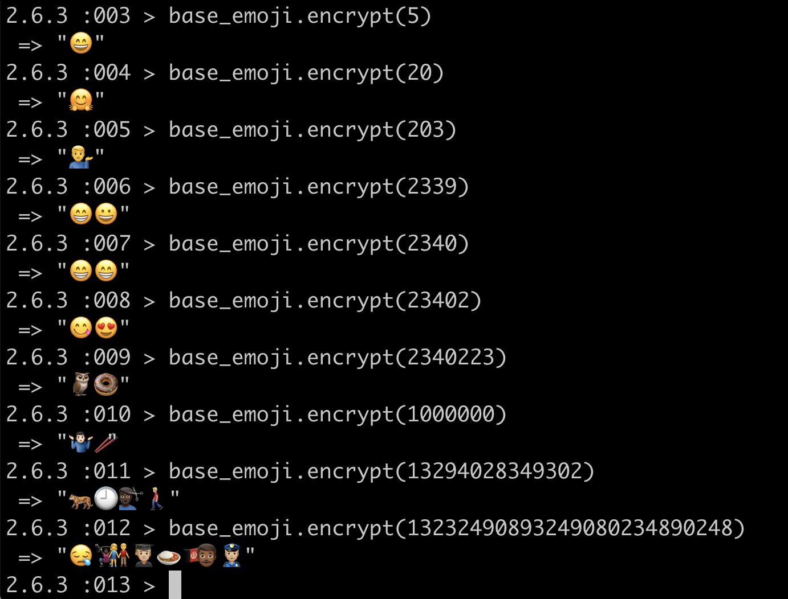

# Emojicrypt < Codex Z




A little ruby side project I wrote in my 7th week of learning to code at Makers. It currently consists of a function that can convert a base-10 number into any base system, given the symbol set. Most importantly, it can convert base-10 numbers into base-emoji (currently equivalent to base-2339, but subject to change)


## Expected input and output examples 

- base: 10, base-10-number-input: 905 => "905"
- base: 2, base-10-number-input: 16 => "10000"
- base: 16, base-10-number-input: 64206 => "FACE"
- base: emojis(2339), base-10-number-input: 1_000_000 => "🤷🏻‍♂️🥢"

## Run this yourself

#### Prerequisites
- Ruby

#### Mac
In terminal:
```sh
$ git clone https://github.com/zi-codes/codex-emojicrypt.git
$ cd codex-emojicrypt
$ irb
```
In irb (or repl of your choice)
```sh
> require_relative 'lib/base_emoji.rb'
```

To convert to base emoji
```sh
> base_emoji = Base.new(Emoji.all)
> base_emoji.encrypt(100)
> base_emoji.encrypt(122314)
> base_emoji.encrypt(1_000_000)
...etc...
```

To convert to any other number base, e.g. base 5
```sh
> base = Base.new(["0","1","2","3","4"])
> base.encrypt(40)
> base.encrypt(208)
...etc...
```
You can also supply your own custom emoji or symbols to convert into instead of a normal number set

#### To run test suite
In terminal (requires Bundler):
```sh
$ bundle install rspec
$ rspec
```

## Author's notes

In various text editors (e.g. atom) some emojis may appear split into two symbols - the emoji itself and the gender identifier. These will still be treated as one emoji

## Codex Z
This repository is part of the "Codex Z" series of my more abstract and puzzly projects. See the rest of them at https://github.com/users/zi-codes/projects/1
